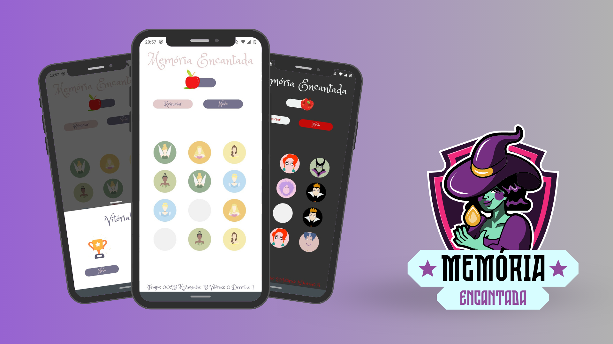

# :sparkles: Memória Encantada - Jogo da Memória

<br>

<div>
  
<div>

## :dart: Sobre

Jogo da memória desenvolvido com propósito de aprimorar os conhecimentos em React Native, Expo, e animações com Lottie.

## :boom: Tecnologias Utilizadas

- [Figma - Layout](https://www.figma.com/community/file/1212020337394409085)

- [React Native](https://reactnative.dev/)

- [Expo](https://expo.io/)

- [Expo Font](https://docs.expo.io/versions/latest/sdk/font/)

- [Typescript](https://www.typescriptlang.org/)

- [Styled Components](https://styled-components.com/)

- [React Modalize](https://jeremybarbet.github.io/react-native-modalize/#/)

## 🧙‍♂️ Começando

Para rodar essa aplicação, você precisa ter o [Node](https://nodejs.org/en) instalado em sua máquina e o [Expo](https://play.google.com/store/apps/details?id=host.exp.exponent&hl=pt_BR&gl=US) instalado em seu celular. Com ambos instalados e preparados, em seu terminal, execute:

Clone o repositório

```shell
git clone https://github.com/ingridsj/disney-memory-game.git
```

Instale as dependências

```shell

yarn

```

Execute o comando

```shell

yarn start

```

Pronto! Você conseguiu rodar a aplicação.

## Agradecimentos

* [Nury](https://github.com/nurycaroline)
* [Luiza Marlene](https://github.com/luizamarlene)
